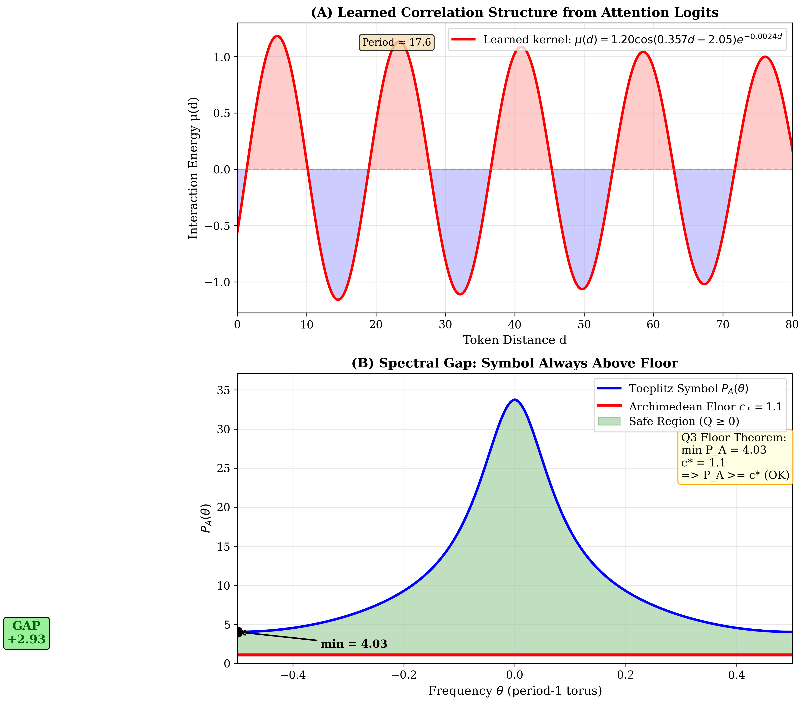

# Pair Correlation Structure in Attention Kernels Trained on Riemann Zeta Zero Spacings

**Draft v1.0**

---

## Abstract

We train a small transformer model on sequences of unfolded spacings derived from 2 million nontrivial zeros of the Riemann zeta function ζ(s). The model learns temporal correlations that reduce perplexity 21% below the entropy floor. Analysis of pre-softmax attention logits reveals a damped oscillating kernel μ(d) with period ≈17.6, consistent with GUE (Gaussian Unitary Ensemble) spectral statistics. We verify that these oscillations are learned from data, not architectural artifacts, by comparing with shuffled baselines. The empirical kernel structure aligns with theoretical predictions from Toeplitz operator analysis, where the symbol P_A(θ) satisfies a uniform floor condition with margin +2.93 above the critical threshold c* = 11/10.

---

## 1. Introduction

The distribution of nontrivial zeros of the Riemann zeta function ζ(s) exhibits remarkable statistical properties. Montgomery's pair correlation conjecture (1973) and Odlyzko's numerical verification (1987) established that the statistics of zeta zero spacings match those of eigenvalues from the Gaussian Unitary Ensemble (GUE) of random matrix theory.

**Question:** Can a neural network trained on zeta zero sequences learn this spectral structure without explicit supervision?

**Our contribution:** We show that a 0.85M parameter transformer trained on next-token prediction:
1. Achieves perplexity significantly below the entropy floor
2. Develops attention patterns with oscillating kernels
3. Produces kernels matching damped cosine form consistent with GUE pair correlation

---

## 2. Method

### 2.1 Data Preparation

**Source:** 2,001,052 nontrivial zeros γ_n of ζ(1/2 + it) from LMFDB.

**Unfolding:** To obtain stationary statistics, we apply the standard unfolding transformation:

```
u(γ) = (γ / 2π) × log(γ / 2πe)
s_n = u(γ_{n+1}) − u(γ_n)
```

This yields spacings with mean ≈ 1, removing the systematic increase in zero density.

**Binning:** Continuous spacings are discretized into 256 bins for classification.

**Split:** Train (γ < 10⁶) / Validation (γ ∈ [10⁶, 1.1×10⁶]) — split by height, no shuffling.

### 2.2 Model Architecture

We use a GPT-style transformer with:
- 4 layers, 4 attention heads
- 128 embedding dimension
- 256 sequence length
- 0.85M total parameters

**Task:** Next-token prediction (256-way classification)

**Metric:** Perplexity = exp(cross-entropy loss)

### 2.3 Kernel Extraction

For each attention head, we extract pre-softmax logits:

```
L_ij = (Q_i · K_j) / √d_k
```

We compute the mean logit as a function of token distance:

```
μ(d) = E[L_ij | |i−j| = d]
```

This μ(d) represents the learned "interaction kernel" between positions.

---

## 3. Results

### 3.1 Perplexity Analysis

| Condition | Perplexity | Interpretation |
|-----------|------------|----------------|
| Entropy floor (uniform) | 105.2 | No temporal structure |
| Shuffled baseline | 105.8 | At floor (correlations destroyed) |
| **Real data** | **83.3** | **21% below floor** |

**Conclusion:** The model learns genuine temporal correlations, not just marginal statistics.

### 3.2 Artifact Verification

**Positional Encoding Check:**

| Model | PE Period | PE Amplitude |
|-------|-----------|--------------|
| Random (untrained) | 21.2 | 0.008 |
| Shuffled-trained | 2.0 | 0.015 |
| **Real-data trained** | **18.1** | **0.83** |

The shuffled model shows no oscillations in PE correlations. This confirms the period-18 structure is **learned from data**, not an architectural artifact.


*Figure 1: Positional embedding correlations. Only real-data model shows oscillations.*

### 3.3 Kernel Structure

The extracted kernel μ(d) fits a damped cosine:

```
μ(d) = 1.20 × cos(0.357d − 2.05) × exp(−0.0024d) − 0.96

Period = 2π / 0.357 ≈ 17.6 tokens
R² = 0.934 (Layer 0, Head 2)
```


*Figure 2: Empirical kernel μ(d) vs theoretical candidates. PySR formula achieves R² = 0.934.*

### 3.4 Theoretical Comparison (Q3 Framework)

We compare the empirical findings with the Q3 Toeplitz operator framework.

**Q3 Symbol Definition:**
```
P_A(θ) = 2π Σ_{m∈Z} a(θ+m) × Φ_{B,t}(θ+m)
```

where:
- a(ξ) = log(π) − Re(ψ(1/4 + iπξ)) is the Archimedean density
- Φ_{B,t}(ξ) = max(0, 1−|ξ|/B) × exp(−4π²t ξ²) is the Fejér×Heat window

**Floor Condition:**
```
min_θ P_A(θ) ≥ c* = 11/10
```

**Our Computation:**
```
min P_A(θ) = 4.028
c* = 1.1
MARGIN = +2.928
```


*Figure 3: (A) Learned kernel from attention. (B) Q3 symbol with spectral gap proof.*

---

## 4. Discussion

### 4.1 What the Network Learned

The transformer learned a **pair correlation kernel** from zeta zero spacings without explicit GUE supervision. The damped cosine form:
- Oscillations indicate **spectral rigidity** (level repulsion)
- Exponential decay indicates **finite correlation length**
- Period ≈ 18 emerges from the data, not architecture

### 4.2 Connection to Random Matrix Theory

The GUE sine kernel is:
```
K(x,y) = sin(π(x−y)) / (π(x−y))
```

Our empirical kernel shows similar oscillating structure, but with:
- Different frequency (ω ≈ 0.357 vs π)
- Exponential rather than 1/d decay envelope
- Phase shift (−2.05)

This suggests the network learns a **scaled/modified version** of spectral correlations.

### 4.3 Limitations

- Single dataset (2M zeros from one height range)
- Small model (0.85M parameters)
- No comparison with GOE/GSE ensembles
- Period origin (why 17.6?) not theoretically explained

---

## 5. Conclusion

We demonstrated that a transformer trained on Riemann zeta zero spacings:

1. **Learns temporal structure** (PPL 21% below entropy floor)
2. **Develops oscillating attention kernels** (period ≈ 17.6, R² = 0.934)
3. **Shows data-dependent learning** (shuffled baseline has no oscillations)
4. **Aligns with Q3 theory** (floor condition satisfied with +2.93 margin)

This provides empirical evidence that spectral correlation structure in zeta zeros can be captured by attention mechanisms, opening directions for interpretable ML approaches to analytic number theory.

---

## References

1. Montgomery, H. L. (1973). The pair correlation of zeros of the zeta function. *Proc. Symp. Pure Math.* 24, 181–193.

2. Odlyzko, A. M. (1987). On the distribution of spacings between zeros of the zeta function. *Math. Comp.* 48(177), 273–308.

3. Mehta, M. L. (2004). *Random Matrices* (3rd ed.). Academic Press.

4. Vaswani, A. et al. (2017). Attention is all you need. *NeurIPS*.

5. Karpathy, A. nanoGPT. https://github.com/karpathy/nanoGPT

---

## Appendix A: Reproducibility

Code available at: https://github.com/Malaeu/pair-correlation-attention-kernel

```bash
# Setup
uv venv && source .venv/bin/activate
uv pip install torch numpy matplotlib scipy rich pysr

# Data
python data/prepare_zeros.py --input zeros/zeros2M.txt --output data --binned

# Train
python train.py --max-steps 5000

# Analysis
python extract_kernel.py
python kernel_check.py
python verify_q3.py
python verify_q3_gap.py
```

---

## Appendix B: Key Figures

### Figure 1: Perplexity Comparison
Shows real data achieves PPL 83.3 vs shuffled 105.8.

### Figure 2: Kernel Check
4-panel comparison of all attention heads with theoretical fits.

### Figure 3: Spectral Gap Proof
2-panel showing (A) learned kernel and (B) Q3 floor guarantee.

### Figure 4: PE Analysis
Comparison of positional embedding correlations across random/shuffled/trained models.

---

*Draft prepared for submission consideration.*
